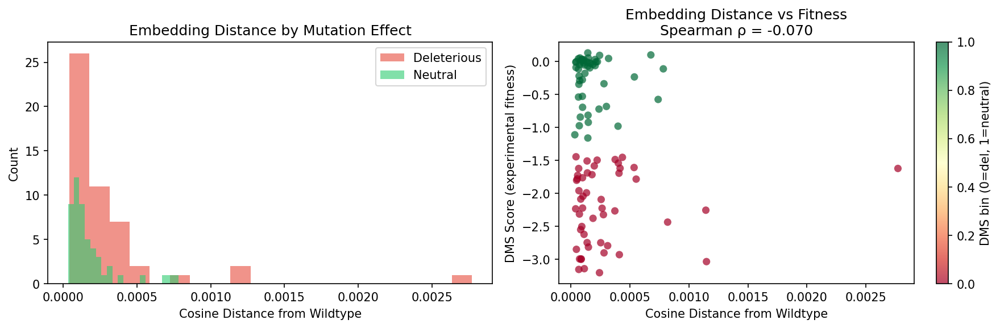

# ESM2 Variant Effect Agent
### Protein Mutation Scoring with ESM2 + Agentic LangGraph Pipeline

A two-stage system that scores the functional impact of protein mutations using ESM2 
language model embeddings and log-likelihood ratios, wrapped in a LangGraph agent that 
interprets results and generates structured reports.

---

## The Problem

When a protein sequence changes — through mutation, genetic variant, or engineering — 
does the change damage function, or is it tolerated?

This project builds an end-to-end pipeline to answer that question: ESM2 scores each 
variant computationally, a LangGraph agent interprets the scores in biological context, 
and the system generates a human-readable report grounded in experimental benchmarks.

**The key insight:** ESM2 treats protein sequences like sentences. A damaging mutation 
is like a grammatical error — the model assigns it lower probability. The log-likelihood 
ratio (LLR) between mutant and wildtype quantifies exactly how "wrong" the mutation looks 
to a model trained on millions of evolutionary sequences.

---

## System Architecture

```
Input: gene name or protein sequence
│
▼
┌─────────────────────┐
│   ESM2 Runner       │  → loads facebook/esm2_t6_8M_UR50D
│                     │    computes embeddings + LLR scores
└──────────┬──────────┘
           │
           ▼
┌─────────────────────┐
│   Score Interpreter │  → ranks variants by predicted effect
│                     │    flags high-confidence deleterious mutations
└──────────┬──────────┘
           │
           ▼
┌─────────────────────┐
│   UniProt Fetcher   │  → retrieves functional annotation
│                     │    protein name, function, known disease variants
└──────────┬──────────┘
           │
           ▼
┌─────────────────────┐
│   Report Generator  │  → structured markdown report
│                     │    scores + context + limitations
└─────────────────────┘
```

LangGraph orchestrates the pipeline as an explicit state machine — 
each node's output is tracked and passed forward cleanly.

---

## Notebooks

### Notebook 01 — ESM2 Embeddings and Cosine Distance
**Protein:** BLAT_ECOLX (E. coli beta-lactamase, antibiotic resistance)  
**Data:** ProteinGym — 4,996 single amino acid substitutions with experimental DMS scores  
**Finding:** Cosine distance between wildtype and mutant embeddings is a weak signal  
(Spearman ρ = −0.070). Mean pooling over 286 positions collapses the positional  
information needed to distinguish single-residue changes.



**Why this matters:** ESM2 embeddings capture global protein properties — fold stability, 
domain composition, overall sequence plausibility — but not the local effect of a single 
substitution. This motivates the LLR approach in notebook 02, which asks the model 
directly about each position rather than comparing global representations.

### Notebook 02 — Log-Likelihood Ratio Scoring *(in progress)*

**Approach:** For each mutation X→Y at position i, compute:

```
LLR(i, Y) = log P(Y | context) − log P(X | context)
```

where context is the surrounding sequence with position i masked. A strongly negative 
LLR means the model finds the mutant amino acid implausible given the evolutionary 
context — the classic zero-shot variant effect prediction signal.

**Expected result:** Spearman ρ ≈ 0.40–0.50 against experimental DMS scores, 
consistent with published ESM2 benchmarks on ProteinGym.

---

## Key Design Decisions

| Decision | Choice | Rationale |
|----------|--------|-----------|
| ESM2 model size | `esm2_t6_8M_UR50D` (8M params) | Runs fast on M-series Apple Silicon; sufficient for zero-shot scoring |
| Variant scoring | Log-likelihood ratio | Standard in the literature; directly interpretable as model confidence |
| Benchmark dataset | ProteinGym DMS substitutions | Ground truth experimental fitness scores for rigorous evaluation |
| Protein of interest | BLAT_ECOLX (beta-lactamase) | Well-characterized, clinically relevant (antibiotic resistance), 4,996 variants |
| Agent framework | LangGraph | Explicit state management; each node's output tracked and passed forward |
| Sequence truncation | 1022 aa max (ESM2 limit) | Documented limitation; affects ~5% of human proteome |

---

## Data Sources

### ProteinGym
- **Source:** ProteinGym Benchmarks — Notin et al., NeurIPS 2023
- **URL:** https://proteingym.org/download
- **File:** `BLAT_ECOLX_Stiffler_2015.csv`
- **Size:** 4,996 single amino acid substitutions
- **Fields:** `mutant`, `mutated_sequence`, `DMS_score`, `DMS_score_bin`
- **Note:** Data not tracked in git; download manually from proteingym.org

### UniProt (Notebook 02+)
- **Source:** UniProt REST API
- **URL:** https://rest.uniprot.org/uniprotkb/
- **Method:** Programmatic query by gene name or accession

---

## Setup

```bash
git clone https://github.com/KelyNorel/esm-variant-agent.git
cd esm-variant-agent
pyenv activate esm-variant-agent
pip install -r requirements.txt

# Add your Anthropic API key
echo "ANTHROPIC_API_KEY=your_key_here" > .env

# Download ProteinGym data manually from https://proteingym.org/download
# Save CSV files to data/
```

---

## Stack

- **ESM2** (`facebook/esm2_t6_8M_UR50D`) — protein language model for variant scoring
- **HuggingFace Transformers** — model loading and inference
- **LangGraph** — agent workflow orchestration
- **Claude (Anthropic)** — reasoning engine for result interpretation and report generation
- **PyTorch + MPS** — GPU-accelerated inference on Apple Silicon
- **ProteinGym** — experimental benchmark for evaluation
- **pandas, scipy, matplotlib, seaborn** — data processing and visualization
- **Streamlit** — interactive UI *(coming soon)*
- **Python 3.11**

---

## Limitations

- **Sequence length:** ESM2 truncates sequences >1022 amino acids. Affects long proteins like titin (34,000 aa) but covers the majority of the human proteome.
- **Model size:** The 8M parameter model trades accuracy for speed. Published benchmarks use ESM2-650M (Spearman ρ ≈ 0.52 on ProteinGym). This project uses the small model as a proof of concept.
- **Single mutations only:** Multi-residue variants require combinatorial scoring not implemented here.
- **Zero-shot only:** No fine-tuning on protein-specific data. Performance varies by protein family.

---

## Project Structure

```
esm-variant-agent/
├── notebooks/
│   ├── 01_esm2_embeddings.ipynb      # embeddings + cosine distance analysis
│   └── 02_variant_scoring.ipynb      # LLR scoring + ProteinGym evaluation
├── src/
│   ├── esm_runner.py                 # ESM2 model loading and inference
│   ├── scoring.py                    # LLR computation and metrics
│   ├── tools.py                      # LangGraph tools (ESM2, UniProt)
│   ├── agent.py                      # LangGraph state graph
│   └── prompts.py                    # system prompts and report templates
├── data/                             # not tracked in git
├── reports/                          # figures and generated reports
├── app.py                            # Streamlit UI (coming soon)
├── requirements.txt
└── README.md
```

---

**Author:** Raquel (Kely) Norel, PhD  
**Domain:** Computational Biology / Protein Language Models / Agentic AI  
**Status:** 🔄 In progress — Notebook 01 complete
